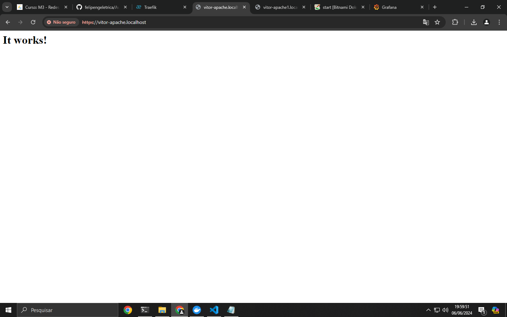
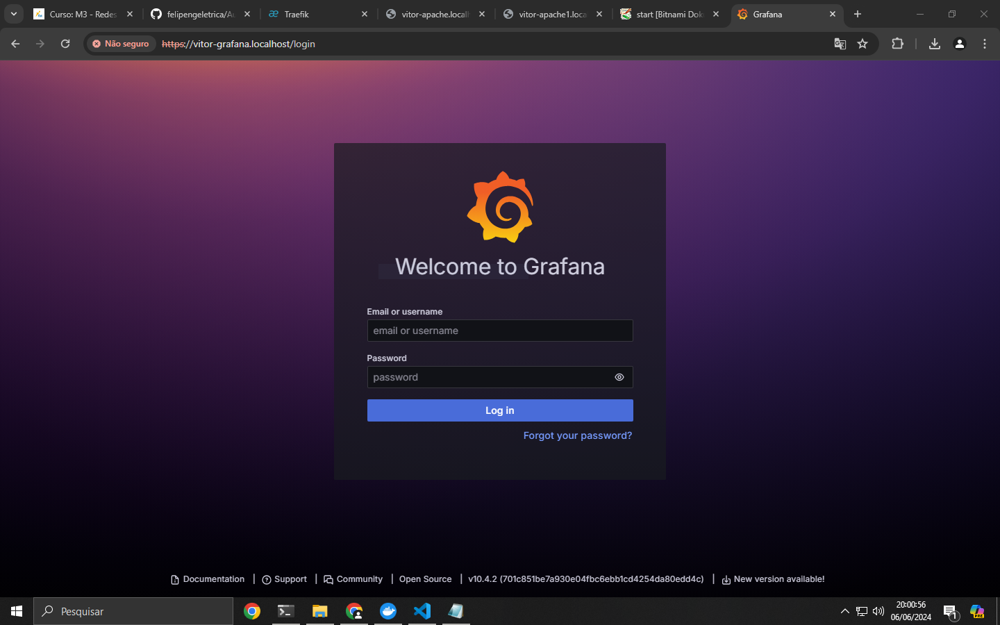
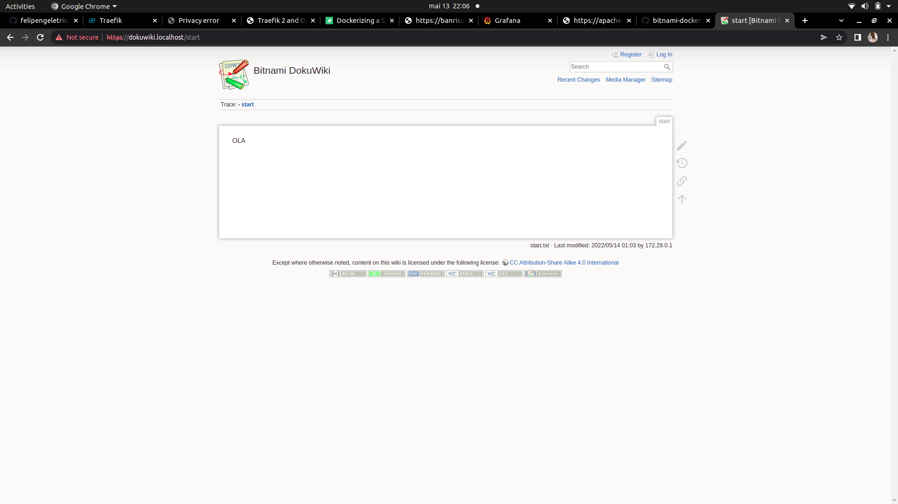

# Projeto PROXY reverso  (DIDÁTICO PARA O USO NAS AULAS DE REDES DE COMPUTADORES)

 Utilizando o Traefik para servidor Apache, Grafana e monitoramento utilizando o dashboard próprio do Traefik.
    
Este projeto utiliza Docker facilitando a implantação (deploy) dos serviços. 
 ***

 ## Implantação dos serviços
 Abrir o terminal e execute os seguintes comandos:
OBS: Antes de executar os comandos abaixo, tive que utilizar esse comando "docker network create web" para criar uma nova rede no Docker.
Construindo e excutando os serviços (pressione ctrl+c para cencelar):
OBS: Este comando cria e inicia os serviços do seu projeto definidos no arquivo docker-compose.yml, construindo as imagens se necessário.
 > $ docker-compose up --build

 Utilize -d para dar um "detach" rodar o serviço na máquina
OBS : Igual ao anterior, mas os serviços são iniciados em segundo plano, permitindo que você continue usando o terminal.
> $ docker-compose up --build -d

Parando serviços:
OBS: Para os serviços, mas não os remove. Os contêineres associados ainda estão presentes.
> $ docker-compose stop

Removendo serviços: 
OBS: Remove os serviços, incluindo os contêineres associados
> $ docker-compose rm
***

 ## Testando os serviços

Utilize o navegador web e digite a seguinte url:
OBS: Este é um exemplo de teste para o serviço Apache. Ao digitar essa URL no navegador, você deve ver uma página da web hospedada pelo servidor Apache.
> http://apache.localhost

  
OBS: : Este é um exemplo de teste para o serviço Grafana. A Ao acessar essa URL, você deve ver a interface do Grafana, que é usada para visualização e análise de dados.
 > http://grafana.localhost

  
OBS: Esta URL é usada para testar um serviço de dashboard específico. No exemplo, pode ser um serviço como o DocuWiki, mas houve uma duplicação do texto.
  > http://dashboard.localhost

  
OBS: Esta URL é usada para testar um serviço de dashboard específico.
  > http://dashboard.localhost
  
